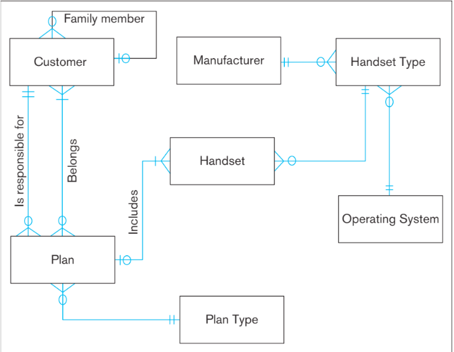

# Entity-Relationship Diagram (ERD) Assignment

## Learning Objectives 🎯

- **Practice identifying entities, attributes, and relationships ✅**
- **Learn to create business rules from a real-world setting ✅**
- **Introduce entity-relationship diagrams with standardized notation ✅**

## Contributors

*List the names of all collaborators on this assignment.*

- [Contributor 1](#)
- [Contributor 2](#)
- [Contributor 3](#)

---

## Part 1: What is an E-R Diagram (ERD) 📝? 

Entity-Relationship (ER) models are expressed using diagrams. To understand how ERDs are created and interpreted, we will begin by looking at an example from the book (p. 100). This example model depicts a theoretical database used for a mobile phone company. Answer the following questions about the ERD below.

### Features of the Diagram

**a. List the features of this diagram. We've done the first one for you.**

- **Boxes:** Represent entities, such as Customer.
- **[Your Answer Here]**
- **[Your Answer Here]**
- **[Continue...]**

### Cardinalities Between Entities

**b. Explain the different types of cardinalities between entities. What does each symbol mean?**

- **One-to-One (1:1):** 
- **One-to-Many (1:N):** 
- **Many-to-Many (M:N):** 

### Two Lines Between CUSTOMER and PLAN

**c. Why are there two lines between CUSTOMER and PLAN? Explain why, and what you think the two lines mean.**

⬇️ Put your answer here 

### Translating the Diagram into Words

**d. Attempt to translate the above diagram into words. Write a list of bullet points with English descriptions of each entity and how it relates to other entities.**

- A **CUSTOMER** can be responsible for many mobile phone **PLANS**, but may be responsible for no plans.
- **[Add here]**

---

## Part 2: Create an ER Diagram Depicting a Scenario of Your Choice

### Scenario Selection

**a. What real-life setting are you modeling?**

*Example: Berea College Library*

### Identify Entities

**b. List out each entity, with a short description or list of attributes.**

- **Book**
  - *Attributes:* Title, ISBN
- **Patron**
  - *Attributes:* Name, Card Number
- **Study Room**
  - *Attributes:* Room Number

### Describe Relationships

**List and describe the relationships between these entities.**

- A patron can check out a book or many books. A patron does not have to check out a book.
- **[Your Business Rules Here]**
- **[Continue describing relationships...]**

### Business Rules

**Create some simple “business rules” describing the relationships between each of the entities.**

- A patron can reserve a study room.
- A book can be reserved by multiple patrons, but only one patron can check out a book at a time.
- **[Add additional business rules...]**

### Construct the ER Diagram

**Based on your list, construct an ER diagram that represents the entities and their relationships.**

- Use a tool like [diagrams.net](https://diagrams.net) to create your diagram.
- Once completed, export or download your diagram as an image.
- Insert your image below.

*Replace `path-to-your-image.png` with the actual path to your uploaded image.*

---

## Part 3: Reflect

**In this assignment, you explored the creation and application of Entity-Relationship diagrams. Describe your thought processes or challenges you encountered while working on these problems.**

*Note: Each individual contributor should write their own reflections here.*

- **Contributor 1:**
  - *Reflection content...*
- **Contributor 2:**
  - *Reflection content...*
- **[Continue for each contributor...]**

---

## Submission

Each contributor should download a PDF copy of the finished worksheet and upload it to Moodle by the posted deadline.

---

